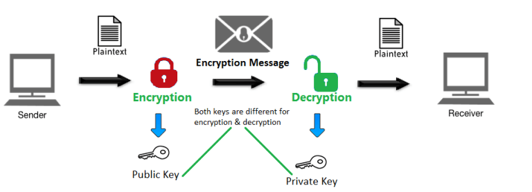
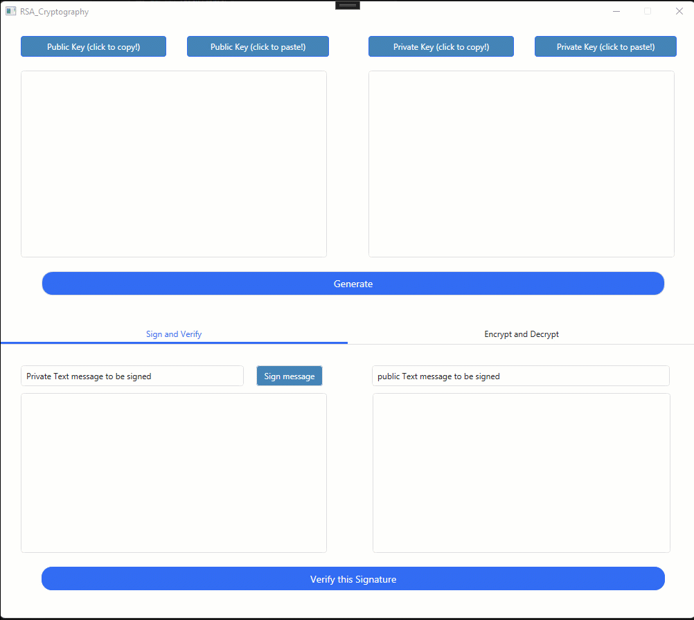
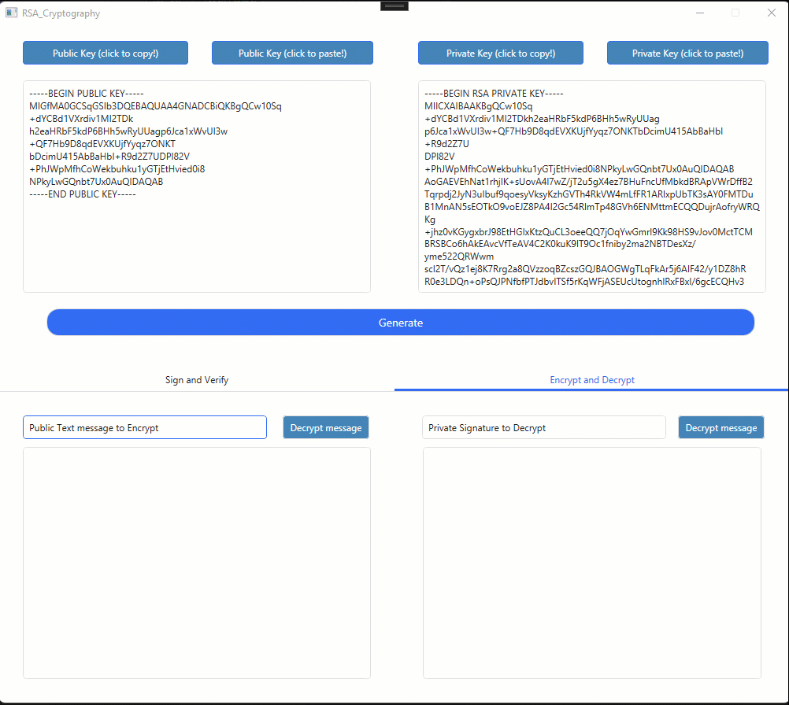

# RSACryptoSystem
Encrypt &amp; Decrypt and Sign &amp; Verify  RSA CryptoSystem

RSA algorithm is an asymmetric cryptography algorithm. Asymmetric actually means that it works on two different keys i.e. Public Key and Private Key. As the name describes that the Public Key is given to everyone and the Private key is kept private. [Source Link](https://www.geeksforgeeks.org/rsa-algorithm-cryptography)



## Demo




## How it works
 - [Document](https://www.idc-online.com/technical_references/pdfs/information_technology/Bouncy_Castle_Net_Implementation_RSA_Algorithm.pdf)
 
## How to use
Clone the project and then open RSACryptoSystem.sln
```bash
  git clone https://github.com/ebrahimkhodadadi/RSACryptoSystem.git
```
